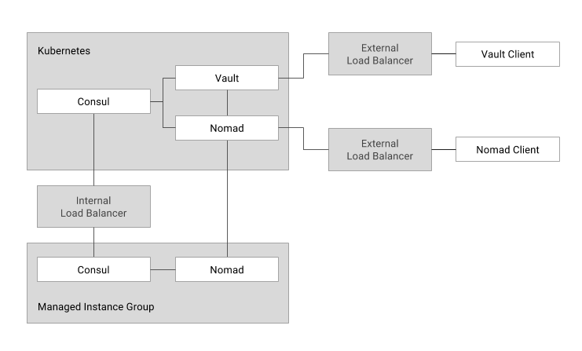

# Nomad on Kubernetes

The Nomad on Kubernetes tutorial documents how to deploy [Nomad](https://www.nomadproject.io/) on [Kubernetes](https://kubernetes.io/). The following diagram provides a high level overview of the Nomad on Kubernetes architecture.



The following components will be deployed to a Kubernetes cluster with minimal CPU and memory allocations to control cost:

* [Consul](https://www.consul.io/) 0.9.2
* [Vault](https://www.vaultproject.io/) 0.8.0
* [Nomad](https://www.nomadproject.io/) 0.6.0

## Rational

Nomad and Kubernetes [have many differences](https://www.nomadproject.io/intro/vs/kubernetes.html) in terms of managing applications but have also been found to [complement each other](https://stackshare.io/circleci/how-circleci-processes-4-5-million-builds-per-month). Nomad is [workload agnostic](https://www.nomadproject.io/docs/drivers/index.html) and supports running non-containerized applications -- broadening the type of workloads you can run across your infrastructure. Other components of the Nomad stack such as Consul and Vault can be leveraged directly within Kubernetes. Consul can provide federated service discovery across multiple Kubernetes clusters and existing platforms such as virtual machines. Vault can provide [robust secrets](https://www.vaultproject.io/intro/use-cases.html) management to Kubernetes workloads including dynamic secret generation.

Kubernetes can ease the deployment and management of Nomad and related components by leveraging some of Kubernetes advanced features including:

* [Advanced Scheduling: Affinity and Anti-affinity](https://kubernetes.io/docs/concepts/configuration/assign-pod-node/)
* [Dynamic Storage Provisioning](https://kubernetes.io/docs/concepts/storage/persistent-volumes/#dynamic)
* [Support for Stateful Applications](https://kubernetes.io/docs/concepts/workloads/controllers/statefulset/)

## Tutorial

* [Prerequisites](docs/01-prerequisites.md)
* [Install Client Tools](docs/02-client-tools.md)
* [Provision The Kubernetes Infrastructure](docs/03-kubernetes-infrastructure.md)
* [Provision The Nomad Infrastructure](docs/04-nomad-infrastructure.md)
* [Provision A Consul Cluster](docs/05-consul.md)
* [Provision A Vault Cluster](docs/06-vault.md)
* [Provision A Nomad Cluster](docs/07-nomad.md)
* [Provision the Nomad Worker Nodes](docs/08-nomad-worker-nodes.md)
* [Running Nomad Jobs](docs/09-nomad-jobs.md)
* [The Consul UI](docs/10-consul-ui.md)

### Clean up

Run the `clean-up` bash script to remove all compute resources created by this tutorial:

```
bash clean-up
```
